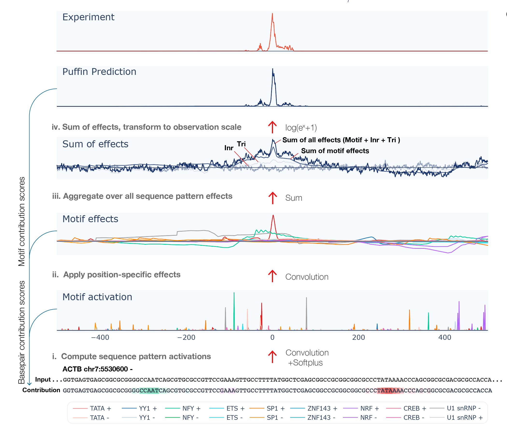

# Puffin

This repository contains code for Puffin and Puffin-D. The associated preprint **“Sequence basis of transcription initiation in human genome”** will be available soon. Puffin is an interpretation-focused sequence model for transcription initiation in the human genome which is also applicable to other mammalian species. 
Puffin can *predict basepair-resolution transcription initiation signals* using only genomic sequence as input,  and more importantly *analyze the sequence basis of any transcription start site (TSS) at motif and basepair levels*. For the prediction-focused deep learning model Puffin-D, scroll to [here](https://github.com/jzhoulab/puffin/tree/main#puffin-d). To reproduce the analyses in our manuscript and training code, please visit our [manuscript repo](https://github.com/jzhoulab/puffin_manuscript).

For most use cases, we highly recommend our user-friendly web server that runs Puffin in your browser with interactive visualization [tss.zhoulab.io](https://tss.zhoulab.io).

## What can I use Puffin for?
- Analyze sequence and motif contribution to transcription initiation for any sequence.
- Predict the effect of mutations on transcription initiation and study its mechanisms.
- Explore and design sequence edits that alter transcription initiation activity.

### Get Started 
#### Installation
For running Puffin locally, clone this repository with the following command.

```
git clone https://github.com/jzhoulab/puffin.git
cd puffin
```

Install python dependencies of Puffin. We recommend creating a new environment (Python version >=3.6) and you can install dependencies using pip
```
pip install -r requirements.txt
```
or install these packages manually to your environment. For using GPU, install pytorch(>=1.7.0) according to [here](https://pytorch.org/get-started/locally/). 

####  Download model and relevant resource files

To download the genome fasta file run following commands
```
wget https://hgdownload.soe.ucsc.edu/goldenPath/hg38/bigZips/hg38.fa.gz
mv  hg38.fa.gz ./resources
cd ./resources
gzip -d hg38.fa.gz
cd ../
```


The first time running the model, an index file will be created for the genome fasta file, which will take longer (a few minutes). Later runs will use the existing index files and will be fast.
The model can work with other genomes too, but the genome path needs to be specified.


#### Command line interface (CLI) Usage

The command line interface (CLI) takes genome sequence as input and outputs transcription initiation signal prediction using Puffin model, as well as Puffin-derived scores for analyzing motif- and basepair-level contributions to transcription initiation.




 
Puffin accepts sequence input in three forms: 

A tsv file specifying genomic regions (the bed file should include at least 4 columns corresponding to ‘chr’, ‘start’, ‘end’, ‘strand’ respectively)
```
python puffin.py region file.tsv
```

A fasta file including the exact sequences
```
python puffin.py sequence file.fasta
```

Directly specifying a genome region in the format of chr:start-end*strand* with no space (e.g.  chr7:5529775-5531425-)
```
python puffin.py coord chr7:5529775-5531425-
```

All genome coordinates should be hg38 and 0-based. The model needs 325bp padding on both side of the sequence, therefore the input length should be the desired output length + 650bp (e.g. use 1650bp to make 1kb prediction).

The script outputs a csv file.  The csv files contains the following rows:

- Sequence: The bases at all positions.
- Motif activations: 18 rows, shows motif activation scores at each position ( motif activation score is analogous to motif match score with soft thresholding by the softplus function)
- Motif effects: 18 rows, shows effect scores from each motif type at each position
- Sum of motif effects:  Sum of motif effects excluding Long Inr +/-
- Sum of initiator effects: Sum of initiator effects including Long Inr +, centered to zero mean
- Sum of trinucleotide effects: Sum of trinucleotide effects, centered to zero mean
- Sum of total effects: Sum of all sequence pattern effects (Long Inr +/-, initiator, and trinucleotide effects were centered to zero mean).
- Prediction: Predicted transcription initiation in log scale, which can be interpreted as ln(count-scale signal+1) scores. Note that Puffin focuses on predicting the shape rather than the scale of the signal, and the scale of transcription depends on also sequence beyond the promoter. Puffin-D offers better predictions of signals if prediction is your primary need.
- Basepair contribution score to transcription initiation: represents the amount of contribution to transcription initiation from each basepair.
- Basepair contribution score to transcription initiation per motif: 20 rows, represents the amount of contribution to transcription initiation from each basepair, decomposed to each motif type.
- Basepair contribution score to motif activation: 20 rows, represents the amount of contribution to motif activation from each basepair, which is computed using only the first layer of Puffin.

#### Optional arguments:

--no_interpretation  If specified, output only predictions. Outputs predictions for all targets and for both strands

--target Default is FANTOM_CAGE. The prediction type can be specified by any one of FANTOM_CAGE, ENCODE_CAGE, ENCODE_RAMPAGE, GRO_CAP, PRO_CAP.
For example to get Pro-cap prediciton run
```
python puffin.py coord --target PRO_CAP chr7:5529775-5531425-
```

--both_strands Default is outputting only prediction for the specified strand. Use this argument to show prediction for both strands.

--cuda Default is using CPU. If specified, use cuda (requires GPU supporting CUDA).


#### API Usage
If you want to use Puffin in your Python code, you can import the Puffin model by 

```
sys,path.append(YOUR_DIRECTORY_FOR PUFFIN)
import puffin
puffin = Puffin()
```

To run the model with cuda use
```
puffin = Puffin(use_cuda=True)
```
```
sequence =”GCGGCCTCCAGATGGTCTGGGAGGGCAGTTCAGCTGTGGCTGCGCATAGCAGACATACAACGGACGGTGGGCCCAGACCCAGGCTGTGTAGACCCAGCCCCCCCGCCCCGCAGTGCCTAGGTCACCCACTAACGCCCCAGGCCTTGTCTTGGCTGGGCGTGACTGTTACCCTCAAAAGCAGGCAGCTCCAGGGTAAAAGGTGCCCTGCCCTGTAGAGCCCACCTTCCTTCCCAGGGCTGCGGCTGGGTAGGTTTGTAGCCTTCATCACGGGCCACCTCCAGCCACTGGACCGCTGGCCCCTGCCCTGTCCTGGGGAGTGTGGTCCTGCGACTTCTAAGTGGCCGCAAGCCACCTGACTCCCCCAACACCACACTCTACCTCTCAAGCCCAGGTCTCTCCCTAGTGACCCACCCAGCACATTTAGCTAGCTGAGCCCCACAGCCAGAGGTCCTCAGGCCCTGCTTTCAGGGCAGTTGCTCTGAAGTCGGCAAGGGGGAGTGACTGCCTGGCCACTCCATGCCCTCCAAGAGCTCCTTCTGCAGGAGCGTACAGAACCCAGGGCCCTGGCACCCGTGCAGACCCTGGCCCACCCCACCTGGGCGCTCAGTGCCCAAGAGATGTCCACACCTAGGATGTCCCGCGGTGGGTGGGGGGCCCGAGAGACGGGCAGGCCGGGGGCAGGCCTGGCCATGCGGGGCCGAACCGGGCACTGCCCAGCGTGGGGCGCGGGGGCCACGGCGCGCGCCCCCAGCCCCCGGGCCCAGCACCCCAAGGCGGCCAACGCCAAAACTCTCCCTCCTCCTCTTCCTCAATCTCGCTCTCGCTCTTTTTTTTTTTCGCAAAAGGAGGGGAGAGGGGGTAAAAAAATGCTGCACTGTGCGGCGAAGCCGGTGAGTGAGCGGCGCGGGGCCAATCAGCGTGCGCCGTTCCGAAAGTTGCCTTTTATGGCTCGAGCGGCCGCGGCGGCGCCCTATAAAACCCAGCGGCGCGACGCGCCACC|ACCGCCGAGACCGCGTCCGCCCCGCGAGCACAGAGCCTCGCCTTTGCCGATCCGCCGCCCGTCCACACCCGCCGCCAGGTAAGCCCGGCCAGCCGACCGGGGCAGGCGGCTCACGGCCCGGCCGCAGGCGGCCGCGGCCCCTTCGCCCGTGCAGAGCCGCCGTCTGGGCCGCAGCGGGGGGCGCATGGGGGGGGAACCGGACCGCCGTGGGGGGCGCGGGAGAAGCCCCTGGGCCTCCGGAGATGGGGGACACCCCACGCCAGTTCGGAGGCGCGAGGCCGCGCTCGGGAGGCGCGCTCCGGGGGTGCCGCTCTCGGGGCGGGGGCAACCGGCGGGGTCTTTGTCTGAGCCGGGCTCTTGCCAATGGGGATCGCAGGGTGGGCGCGGCGGAGCCCCCGCCAGGCCCGGTGGGGGCTGGGGCGCCATTGCGCGTGCGCGCTGGTCCTTTGGGCGCTAACTGCGTGCGCGCTGGGAATTGGCGCTAATTGCGCGTGCGCGCTGGGACTCAAGGCGCTAACTGCGCGTGCGTTCTGGGGCCCGGGGTGCCGCGGCCTGGGCTGGGGCGAAGGCGGGCTCGGCCGGAAGGGGTGGGGTCGCCGCGGCTCCCGGGCGCTTGCGCGCACTTCCTGCCCGAGCCGCTGGCCGCCCGAGGGTGTGGCCGCTGCGTGCGCGCGCGCCGACCCGGCGCTGTTTGAACCGGGCGGAGGCGGGGCTGGCGCCCGGTTGGGAGGGGGTTGGGGCCTGGCTTCCTGCCGCGCGCCGCGGGGACGCCTCCGACCAGTGTTTGCCTTTTATGGTAATAACGCGGCCGGCCCGGCTTCCTTTGTCCCCAATCTGGGCGCGCGCCGGCGCCCCCTGGCGGCCTAAGGACTCGGCGCGCCGGAAGTGGCCAGGGCGGGGGCGACCTCGGCTCACAGCGCGCCCGGCTATTCTCGCAGCTCACCATGGATGATGATATCGCCGCGCTCGTCGTCGACAACGGCTCCGGCATGTGCAAGGC”

puffin.interpret(sequence, target=’FANTOM_CAGE’)
```
returns an interpretation DataFrame, the rows are the same as the csv file returned by CLI above

```
puffin.predict(sequence)
```
returns a prediction-only DataFrame


# Puffin-D
Puffin-D is a deep learning model that predicts tanscription inititation signal for 100Kbp genome sequence. Command line interface outputs a numpy array with prediciton for each target in following order: FANTOM_CAGE (+ strand), ENCODE_CAGE (+ strand), ENCODE_RAMPAGE (+ strand), GRO_CAP (+ strand), PRO_CAP (+ strand), PRO_CAP (- strand), GRO_CAP (- strand), ENCODE_RAMPAGE (- strand), ENCODE_CAGE (- strand), FANTOM_CAGE (- strand).

#### Puffin-D command line interface (CLI) Usage
Download Puffin-D model file
```
wget https://zenodo.org/record/7941729/files/puffin_D.pth
mv puffin_D.pth ./resources
```

Similar to Puffin, Puffin-D accepts sequence input in three forms: 

A tsv file specifying genomic regions (the bed file should include at least 4 columns corresponding to ‘chr’, ‘start’, ‘end’, ‘strand’ respectively)
```
python puffin_D.py region file.tsv
```

A fasta file including the exact sequences
```
python puffin_D.py sequence file.fasta
```

Directly specifying a genome region in the format of chr:sequence center position*strand* with no space (e.g. chr7:5530600-)
```
python puffin_D.py coord chr7:5530600-
```
#### Optional arguments:
--cuda Default is using CPU. If specified, use cuda (requires GPU supporting CUDA).

#### API Usage

For API usage, import Puffin-D model
```
sys.path.append(YOUR_DIRECTORY_FOR PUFFIN-D)
import puffin_D
puffin_D = Puffin_D()
```
To run the model with cuda use
```
puffin_D = Puffin_D(use_cuda=True)
```
To run the model prediciton use the following command, where input sequence length is 100Kbp
```
prediction = puffin_d.predict(sequence)
```

#### Questions and feedbacks

Thank you for using Puffin. If you have any questions or feedback, you can let us know at the [Discussions tab](https://github.com/jzhoulab/puffin/discussions). If you found a bug, you can file a Github issue with details for reproducing the bug. Puffin is completely free for any non-commercial and academic use, and please contact us for commercial applications.

